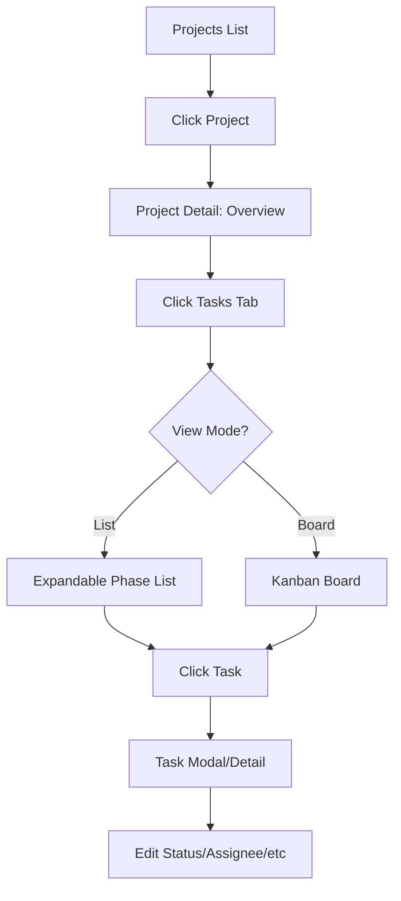
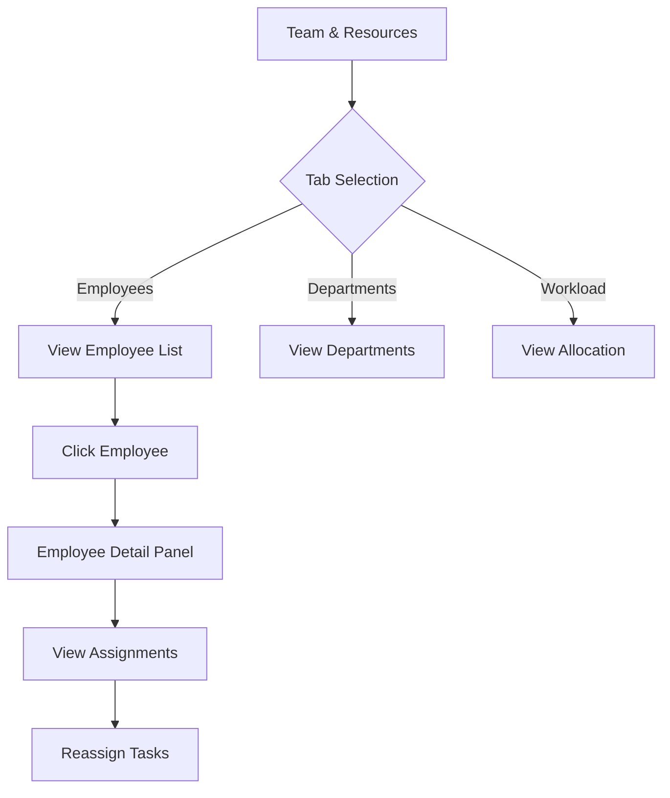

# EngiPro Manager - Implementation Audit

**Audit Date:** January 18, 2026  
**Auditor:** AI Assistant  
**Application Version:** 0.0.0

---

## Table of Contents

1. [Executive Summary](#executive-summary)
2. [Technology Stack](#technology-stack)
3. [Application Architecture](#application-architecture)
4. [Information Architecture](#information-architecture)
5. [Page-by-Page Analysis](#page-by-page-analysis)
6. [User Flows](#user-flows)
7. [Actions Inventory](#actions-inventory)
8. [UX Implementation Review](#ux-implementation-review)
9. [Accessibility & Responsiveness](#accessibility--responsiveness)
10. [Recommendations](#recommendations)

---

## Executive Summary

**EngiPro Manager** is an engineering project management system designed for managing construction/engineering projects, team resources, authority tracking (permits/licenses), and role-based access control. The application is built as a Single Page Application (SPA) with React and TypeScript, featuring bilingual support (English/Arabic) with RTL layout support.

### Key Metrics
| Metric | Count |
|--------|-------|
| Total Pages | 9 |
| Total Components | 36+ |
| Navigation Items | 6 |
| User Roles Defined | 5 |
| Permission Categories | 7 |

### Implementation Status
- ✅ **Core Navigation** - Fully implemented
- ✅ **Dashboard** - Fully implemented with KPIs and charts
- ✅ **Project Management** - Comprehensive implementation
- ✅ **Task Management** - Multi-view support (list, board, calendar)
- ✅ **Authority Tracking** - Fully implemented
- ✅ **Team Management** - Employees, departments, workload views
- ✅ **RBAC System** - Roles and permissions management
- ✅ **Bilingual Support** - Arabic/English with RTL
- ⚠️ **Backend Integration** - Using mock data (frontend only)
- ⚠️ **Authentication** - Not implemented

---

## Technology Stack

### Frontend Framework
| Technology | Version | Purpose |
|------------|---------|---------|
| React | 18.x | UI Framework |
| TypeScript | 5.x | Type Safety |
| Vite | 6.4.1 | Build Tool |
| React Router | 6.x | Client-side Routing |

### Styling & UI
| Technology | Purpose |
|------------|---------|
| Tailwind CSS | Utility-first CSS |
| Lucide React | Icon Library |
| Recharts | Data Visualization |

### State Management
- React Context API (LanguageContext)
- Component-level local state (useState)

---

## Application Architecture

### File Structure
```
engipro-manager/
├── App.tsx                    # Main application component with routing
├── index.tsx                  # Application entry point
├── types.ts                   # TypeScript type definitions
├── constants.ts               # Mock data and constants
├── translations.ts            # i18n translations
├── vite.config.ts             # Vite configuration
├── contexts/
│   └── LanguageContext.tsx    # Language/i18n context provider
├── components/
│   ├── Layout.tsx             # Main layout with sidebar
│   ├── Dashboard.tsx          # Dashboard page
│   ├── ProjectsList.tsx       # Projects listing page
│   ├── ProjectDetail.tsx      # Project detail page
│   ├── CreateProjectWizard.tsx# Project creation wizard
│   ├── MyTasks.tsx            # User tasks page
│   ├── AuthorityTracking.tsx  # Authority/permits page
│   ├── TeamManagement.tsx     # Team management page
│   ├── RolesManagement.tsx    # RBAC page
│   ├── project-detail/        # Project detail sub-components
│   ├── wizard/                # Project wizard steps
│   ├── team/                  # Team management sub-components
│   ├── roles/                 # Role management sub-components
│   └── my-tasks/              # Task view sub-components
└── utils/                     # Utility functions
```

### Routing Configuration
```typescript
Routes:
├── /                          → Redirects to /dashboard
├── /dashboard                 → Dashboard
├── /my-tasks                  → My Tasks
├── /projects                  → Projects List
├── /projects/new              → Create Project Wizard
├── /projects/:id              → Project Detail
├── /authority                 → Authority Tracking
├── /team                      → Team Management
└── /roles                     → Roles & Permissions
```

---

## Information Architecture

### Primary Navigation (Sidebar)

```
📊 Dashboard
   └── Overview metrics, charts, alerts, priority tasks

✅ My Tasks
   └── Personal task management with list/board/calendar views

📁 Projects
   └── All projects list with filtering and bulk actions
   └── Project Detail (7 tabs)
       ├── Overview
       ├── Tasks
       ├── Gantt
       ├── Team
       ├── Documents
       ├── Authority
       └── Activity

📄 Authority Tracking
   └── Permit/license application management

👥 Team & Resources
   └── Tabs: Employees | Departments | Workload

─────────── Admin ───────────

🛡️ Roles & Permissions
   └── Tabs: Roles List | Audit Log
```

### Data Entity Relationships

```
Project
├── Client (1)
├── Manager (User)
├── Phases (many)
│   └── Tasks (many)
│       └── Assignee (User)
│       └── Dependencies (Task[])
├── Documents (many)
├── Activity Log (many)
└── Authority Applications (linked)

Employee (extends User)
├── Department
├── Active Projects
└── Task Assignments

Role
├── Permissions[]
└── User Count
```

---

## Page-by-Page Analysis

### 1. Dashboard (`/dashboard`)

**Purpose:** Executive overview of system metrics and priority items

**Components:**
- Welcome Banner (personalized greeting)
- KPI Cards (6 metrics)
- Status Overview Chart (Pie chart)
- Active by Department Chart (Bar chart)
- Alerts Feed
- Priority Tasks Widget

**KPI Metrics:**
| Metric | Description |
|--------|-------------|
| Active Projects | Count of active projects |
| Tasks Due Today | Tasks due today count |
| Overdue | Overdue tasks (highlighted in red) |
| Pending Approvals | Documents awaiting approval |
| Completion Rate | Overall completion percentage |
| My Assigned | Tasks assigned to current user |

**Actions:**
- View All Alerts
- Go to Tasks
- Navigate to Projects

---

### 2. My Tasks (`/my-tasks`)

**Purpose:** Personal task management for the logged-in user

**View Modes:**
1. **List View** - Tabular task listing
2. **Board View** - Kanban-style status columns
3. **Calendar View** - Calendar grid with task dots

**Quick Stats:**
- Due Today
- Overdue
- Blocked
- Completed Today

**Filtering:**
- Search by task/project name
- Status filter (All, Not Started, In Progress, Blocked, Completed)
- Priority filter (High, Medium, Low)

**Actions:**
- Toggle view mode (list/board/calendar)
- Filter tasks
- Search tasks
- Click task to view details

---

### 3. Projects List (`/projects`)

**Purpose:** Central hub for all project management

**View Modes:**
1. **Grid View** - Project cards
2. **List View** - Tabular format

**Filtering & Sorting:**
- Search by project name
- Status filter (All, Not Started, In Progress, On Hold, Completed)
- Department filter

**Bulk Actions (when items selected):**
- Archive selected
- Assign to...
- Export selected

**Project Card Information:**
- Project name
- Client name
- Status badge (color-coded)
- Progress bar
- Department tags
- Authority status indicator (traffic light)
- Task completion count
- Start/End dates

**Actions:**
- Create new project
- View project details
- Edit project
- Delete project
- Bulk selection

---

### 4. Project Detail (`/projects/:id`)

**Purpose:** Comprehensive project management interface

**Tabbed Interface (7 tabs):**

#### Tab 4.1: Overview
- Progress ring visualization
- Project timeline
- Client information
- Manager info
- Department assignments
- Status breakdown
- Recent activity preview

#### Tab 4.2: Tasks
**View Modes:**
- List View (expandable phases)
- Board View (Kanban)

**Features:**
- Phase-based grouping
- Inline status change
- Assignee management
- Due date display
- Priority indicators
- Dependencies visualization
- Task creation modal

**Actions:**
- Add new task
- Edit task
- Delete task
- Change status
- Manage dependencies
- Assign team members

#### Tab 4.3: Gantt Chart
- Visual timeline representation
- Task bars with duration
- Today marker
- Task type color coding (Internal/External/Completed)
- Zoom controls
- Export option

#### Tab 4.4: Team
- Team members listing
- Role assignments
- Avatar display
- Contact options

#### Tab 4.5: Documents
- Folder hierarchy structure
- File type icons
- Version tracking
- Upload capability
- Document preview

#### Tab 4.6: Authority
- Linked authority applications
- Status badges
- Submission tracking
- Document attachments

#### Tab 4.7: Activity
- Chronological activity feed
- Activity type icons
- User attribution
- Timestamp display

**Header Actions:**
- Status dropdown (change project status)
- Edit project
- More options menu

---

### 5. Create Project Wizard (`/projects/new`)

**Purpose:** Multi-step project creation process

**5-Step Wizard:**

#### Step 1: Basic Information
- Project name
- Project type (Residential, Commercial, Industrial, etc.)
- Services selection (multi-select)
- Department assignment
- Location (City, District, Address)
- Start date
- Description

#### Step 2: Client & Team
- Client selection (existing or new)
- New client form:
  - Name, Type, Contact, Email, Phone, Company
- Sub-clients management
- Project manager selection
- Team members selection

#### Step 3: Phases
- Phase name
- Phase order
- Phase description
- Add/remove phases

#### Step 4: Tasks
- Task name
- Phase assignment
- Duration
- Task type (Internal/External)
- Assignee
- Dependencies
- Priority

#### Step 5: Review
- Summary of all entered data
- Final validation
- Create project action

**Actions:**
- Next/Previous step
- Save as draft
- Cancel
- Create project

---

### 6. Authority Tracking (`/authority`)

**Purpose:** Manage government/authority applications and permits

**View Options:**
- Grid View
- List View

**Application Card Information:**
- Tracking ID
- Authority name
- Application type
- Project link
- Submission date
- Expected response date
- Days waiting
- Status badge
- Last update

**Status Types:**
- Pending (blue)
- Approved (green)
- Rejected (red)
- Info Required (amber)

**Detail Panel (slide-out):**
- Full application details
- Document uploads
- Status history timeline
- Notes

**Actions:**
- Create new application
- Upload documents
- Update status
- Add notes
- Link to project task

---

### 7. Team Management (`/team`)

**Purpose:** Human resource and team management

**3-Tab Interface:**

#### Tab 7.1: Employees
**Features:**
- Grid/List view toggle
- Search employees
- Status filter (Active, Inactive, On Leave)
- Department filter

**Employee Card:**
- Avatar
- Name & role
- Department badge
- Email & phone
- Active projects count
- Open tasks count
- Utilization indicator

**Employee Detail Panel:**
- Full profile information
- Project assignments
- Task history
- Performance metrics

**Actions:**
- Add employee
- Edit employee
- View details
- Filter by status/department

#### Tab 7.2: Departments
- Department cards
- Head of department
- Employee count
- Active project count
- Department description

**Actions:**
- Create department
- Edit department
- View department details

#### Tab 7.3: Workload
- Resource allocation visualization
- Utilization metrics
- Capacity planning

---

### 8. Roles & Permissions (`/roles`)

**Purpose:** Role-based access control management

**2-Tab Interface:**

#### Tab 8.1: Roles List
**View Modes:**
- Grid View
- List View

**Role Card:**
- Role name
- Description
- User count
- System role indicator
- Permission count

**Role Modal (Create/Edit):**
- Role name
- Description
- Permission matrix by category:
  - Projects
  - Tasks
  - Documents
  - Team
  - Authority
  - Reports
  - Admin

**Actions:**
- Create role
- Edit role
- Duplicate role
- Delete role (non-system)

#### Tab 8.2: Audit Log
- Chronological log entries
- User, action, details, timestamp
- Search/filter capabilities

---

## User Flows

### Flow 1: Create New Project

```mermaid
graph TD
    A[Dashboard / Projects List] --> B[Click "New Project"]
    B --> C[Step 1: Basic Info]
    C --> D[Step 2: Client & Team]
    D --> E[Step 3: Phases]
    E --> F[Step 4: Tasks]
    F --> G[Step 5: Review]
    G --> H{Create or Save Draft?}
    H -->|Create| I[Redirect to Projects List]
    H -->|Save Draft| J[Save & Continue Later]
```

### Flow 2: Manage Project Tasks



### Flow 3: Authority Application Process

```mermaid
graph TD
    A[Authority Tracking] --> B[Click "New Application"]
    B --> C[Fill Application Form]
    C --> D[Upload Documents]
    D --> E[Submit]
    E --> F[Application Created - Pending]
    F --> G{Authority Response}
    G -->|Approved| H[Mark Approved]
    G -->|Rejected| I[Mark Rejected]
    G -->|Info Required| J[Request Info]
    J --> K[Upload Additional Docs]
    K --> F
```

### Flow 4: Team Resource Management



### Flow 5: Role Permission Setup

```mermaid
graph TD
    A[Roles & Permissions] --> B[Click "Create Role"]
    B --> C[Enter Role Name/Description]
    C --> D[Configure Permission Matrix]
    D --> E[Save Role]
    E --> F[Assign to Users]
```

---

## Actions Inventory

### Global Actions
| Action | Location | Implementation |
|--------|----------|---------------|
| Toggle Sidebar | Header | ✅ Hamburger menu |
| Toggle Language | Header | ✅ Arabic/English toggle |
| Search | Header | ⚠️ UI only, no functionality |
| Notifications | Header | ⚠️ UI only, no functionality |
| Create Project | Header | ✅ Navigate to wizard |

### Dashboard Actions
| Action | Implementation |
|--------|---------------|
| View All Alerts | ⚠️ Link only |
| Go to Tasks | ✅ Navigate to projects |
| Click KPI Card | ❌ Not implemented |
| Click Priority Task | ❌ Not navigating |

### Projects Actions
| Action | Implementation |
|--------|---------------|
| Create Project | ✅ Full wizard flow |
| View Project | ✅ Navigate to detail |
| Edit Project | ⚠️ Header status only |
| Delete Project | ⚠️ Confirmation only |
| Bulk Select | ✅ Implemented |
| Bulk Archive | ⚠️ UI only |
| Filter by Status | ✅ Implemented |
| Toggle View Mode | ✅ Grid/List |

### Task Actions
| Action | Implementation |
|--------|---------------|
| Create Task | ✅ Modal with full form |
| Edit Task | ✅ Inline editing |
| Delete Task | ⚠️ Confirmation only |
| Change Status | ✅ Dropdown/drag |
| Assign User | ✅ Dropdown |
| Add Dependency | ✅ Modal |
| Remove Dependency | ✅ Click to remove |

### Authority Actions
| Action | Implementation |
|--------|---------------|
| Create Application | ⚠️ UI only |
| Upload Document | ⚠️ UI only |
| Update Status | ⚠️ UI only |
| View History | ✅ Slide-out panel |
| Add Notes | ⚠️ UI only |

### Team Actions
| Action | Implementation |
|--------|---------------|
| Add Employee | ✅ Modal form |
| Edit Employee | ⚠️ Detail panel |
| Filter Employees | ✅ Implemented |
| Add Department | ✅ Modal form |
| View Workload | ✅ Visualization |

### Role Actions
| Action | Implementation |
|--------|---------------|
| Create Role | ✅ Modal with matrix |
| Edit Role | ✅ Modal with matrix |
| Duplicate Role | ✅ Implemented |
| Delete Role | ✅ With confirmation |
| View Audit Log | ✅ Implemented |

---

## UX Implementation Review

### Design System

#### Color Palette
| Usage | Color | Hex |
|-------|-------|-----|
| Primary | Blue | #3B82F6 |
| Sidebar | Slate | #0F172A |
| Success | Green | #10B981 |
| Warning | Amber | #F59E0B |
| Danger | Red | #EF4444 |
| Info | Indigo | #6366F1 |
| Background | Gray | #F9FAFB |

#### Typography
- **Headings:** Bold, sizes 2xl, xl, lg
- **Body:** Regular, size sm/base
- **Labels:** Uppercase, xs, font-semibold
- **RTL Support:** Full implementation

#### Components
- **Cards:** Rounded-xl, shadow-sm, border
- **Buttons:** Rounded-lg/md, hover states
- **Badges:** Rounded-full, color-coded
- **Inputs:** Rounded-md, focus rings
- **Modals:** Overlay backdrop, slide animations

### Responsive Breakpoints
| Breakpoint | Behavior |
|------------|----------|
| Mobile (<768px) | Sidebar overlay, hamburger menu |
| Tablet (768px-1024px) | Collapsible sidebar |
| Desktop (>1024px) | Full sidebar |

### Micro-interactions
| Component | Animation |
|-----------|-----------|
| Sidebar | Slide in/out (300ms) |
| Mobile Overlay | Fade transition |
| Button Hover | Scale/color change |
| Task Drag | Smooth drag-n-drop |
| Progress Bars | Width transitions |
| Tabs | Border-bottom highlight |

### Loading States
⚠️ **Not implemented** - Application uses synchronous mock data

### Error States
⚠️ **Not implemented** - No error boundaries or form validation UX

---

## Accessibility & Responsiveness

### Accessibility Audit

#### Strengths
- ✅ Semantic HTML structure
- ✅ ARIA labels on icon buttons
- ✅ Focus visible states
- ✅ Color contrast (mostly compliant)
- ✅ RTL language support

#### Areas for Improvement
- ❌ Missing skip navigation link
- ❌ No keyboard navigation for modals
- ❌ Missing form field labels (some inputs)
- ❌ No aria-live regions for dynamic content
- ❌ No reduced motion preferences

### Responsiveness Audit

#### Mobile View (375px)
- ✅ Sidebar becomes overlay
- ✅ Hamburger menu toggle
- ✅ Cards stack vertically
- ✅ Header adapts (hidden "New Project" button)
- ⚠️ Some tables need horizontal scroll
- ⚠️ Gantt chart needs mobile alternative

#### Tablet View (768px)
- ✅ Grid columns adjust (2-3 columns)
- ✅ Sidebar collapsible
- ✅ Charts resize properly

#### Desktop View (1024px+)
- ✅ Full sidebar visible
- ✅ 6-column KPI grid
- ✅ Optimal chart sizes

---

## Recommendations

### High Priority

1. **Backend Integration**
   - Implement API layer with real database
   - Add authentication/authorization
   - Implement real-time updates (WebSocket)

2. **Data Persistence**
   - All CRUD operations are mock
   - Implement Supabase or similar backend

3. **Search Functionality**
   - Currently UI only
   - Implement global search across entities

4. **Form Validation**
   - Add Zod or similar for schema validation
   - Display error messages
   - Prevent submission of invalid data

### Medium Priority

5. **Loading States**
   - Add skeleton loaders
   - Implement Suspense boundaries
   - Add loading spinners for async operations

6. **Error Handling**
   - Add error boundaries
   - Implement toast notifications
   - Add retry mechanisms

7. **Mobile Optimization**
   - Alternative view for Gantt chart on mobile
   - Swipe gestures for task status change
   - Bottom sheet modals on mobile

8. **Performance**
   - Implement virtual scrolling for long lists
   - Lazy load heavy components
   - Optimize re-renders

### Low Priority

9. **PWA Support**
   - Add service worker
   - Enable offline mode
   - Add install prompt

10. **Analytics & Reporting**
    - Implement custom report builder
    - Add export functionality (PDF, Excel)
    - Dashboard customization

11. **Notifications**
    - Real notification system
    - Push notifications
    - Email integration

12. **Collaboration Features**
    - Comments on tasks/projects
    - @mentions
    - Real-time cursors

---

## Appendix

### Type Definitions Summary

```typescript
// Core Types
ProjectStatus = 'Not Started' | 'In Progress' | 'On Hold' | 'Completed' | 'Cancelled'
Department = 'Architecture' | 'Civil' | 'Safety' | 'Surveying' | 'Modern' | 'Khitbrah'
TaskType = 'Internal' | 'External'
AuthorityStatus = 'Pending' | 'Approved' | 'Rejected' | 'Info Required'
TrafficLightStatus = 'Green' | 'Yellow' | 'Red'
TaskPriority = 'Low' | 'Medium' | 'High'

// Entity Types
Project, Task, Phase, User, Employee, Client
AuthorityApplication, Role, PermissionDefinition
```

### Permission Matrix

| Category | Permissions |
|----------|-------------|
| Projects | view, create, edit, delete, archive |
| Tasks | view, create, edit, delete, assign, change_status |
| Documents | view, upload, download, delete, manage_versions |
| Team | view, add, remove, manage_assignments |
| Authority | view, create, update, delete |
| Reports | view, export, create_custom |
| Admin | manage_users, manage_roles, manage_settings |

### Mock Data Summary

| Entity | Count |
|--------|-------|
| Projects | 5 |
| Clients | 2 |
| Users | 5 |
| Employees | 6 |
| Departments | 6 |
| Roles | 5 |
| Authority Applications | 4 |

---

*This audit was generated on January 18, 2026. For updates or corrections, please regenerate with the latest codebase.*
